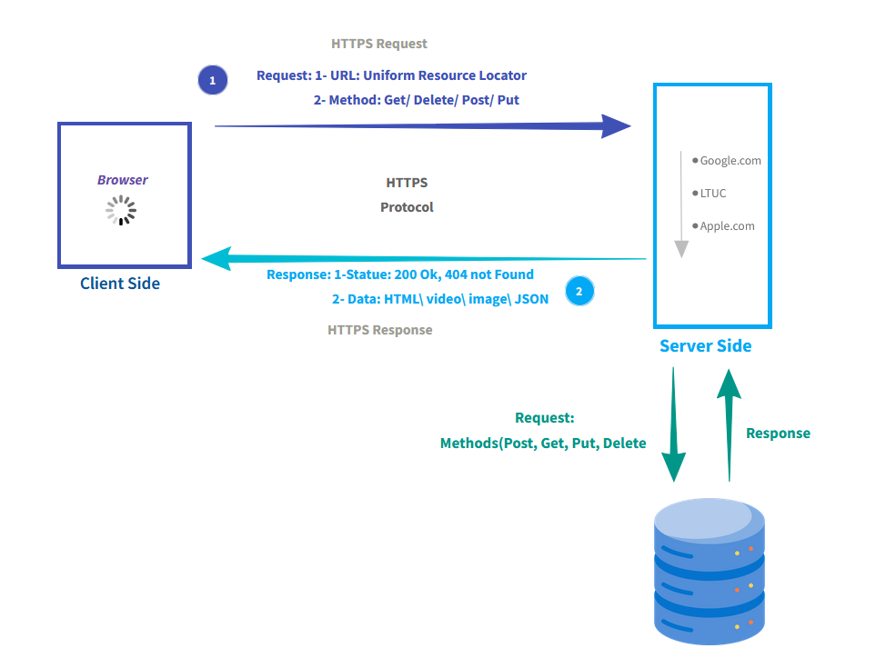

> # Movies_Library - V.0.2 📽️
  **Author Name**: Haya Al-Sughair 
## Web Request Response Cycle (WRRC)

## Overview 
This project is an Express.js API for accessing movie data. It lets users fetch trending movies and search for movies by title. The app connects to TMDB (The Movie Database) API to get movie information.

## Getting Started
1. Creating the Data Base 
    - Make sure the DB is running using `sqlstart`
    - `psql`
    - `CREATE DATABASE YourdbName`
    - `\l` list of DataBase
    - `\q` to quit psql 
2. Creating the Table 
    - create a SQL File  `schema.sql ` file in my project 
    - Create Table
        ```
        CREATE TABLE table_name (
            column1 datatype,
            column2 datatype,
            column3 datatype,
        ....
        ); 
        ```
3. Connect the DB with table (Terminal)
    - `psql DB name` 
    - `\d` check if table exexists
    - `\q ` To quit 
    - `psql -d DBname -f filename `

4. To Write qureis in Js File:
    - install postgres package `npm install pg `


## New Project Features   
Use CRUD (Create, Read, Update, Delete) 
1. Add Movie (handleAdd):
    This feature allows clients to send a POST request to the /addMovie endpoint with the details of a movie in the request body.

2. Get Movie (handleGet):
    This feature allows clients to send a GET request to the /getMovie endpoint to retrieve all movies from the database.

    

> # Movies_Library - V.0.1 📽️
  **Author Name**: Haya Al-Sughair 
## Web Request Response Cycle (WRRC)

## Overview 
This project is an Express.js API for accessing movie data. It lets users fetch trending movies and search for movies by title. The app connects to TMDB (The Movie Database) API to get movie information.

## Getting Started
- Using Nodejs (RunTime enviroment )
- Install the cors Package (`$ npm install cors`) Using By:
    - `var cors = require('cors')`
    - `app.use(cors())`
- Install nodemon Package (`$npm i nodemon`)
    - `npm i -g nodemon`.
    - If you face error in access use this : `sudo npm i -g nodemon`.
    - `nodemon File-Name `.

## New Project Features   
- Trending Movies Endpoint:

    Endpoint: `/trending`.

    Description: Retrieves a list of trending movies from the TMDB API and returns the data as JSON.
- Search Movies Endpoint:

     Endpoint: `/search`. 

    Description: Allows users to search for movies based on their titles. Users can provide a query parameter (movieName) to search for specific movies. The endpoint queries the TMDB API and returns the search results as JSON.


> # Movies_Library - V.0.0 

## Web Request Response Cycle (WRRC)

## Overview
This application serves as a basic framework for serving movie data and handling simple HTTP requests.
## Getting Started
- Node JS (Runtime enviroment) 
- Building a server : 
    - Use Express (Frame Work for node js ) By :
        - `npm init -y`: Use this command to create a package.json .
        - `npm install express` : To install the express package.
        - `npm file name ` : To run the server.

## Project Features
1.  Routing 
    - Home Routing. 
    - Favorite Routing .
2. Error Handling: The app handel two type of error 
    - 500:Internal Server Error "Sorry, something went wrong".
    - 404: "Not Found".
3. Server SetUp.
4. Data Handling.
